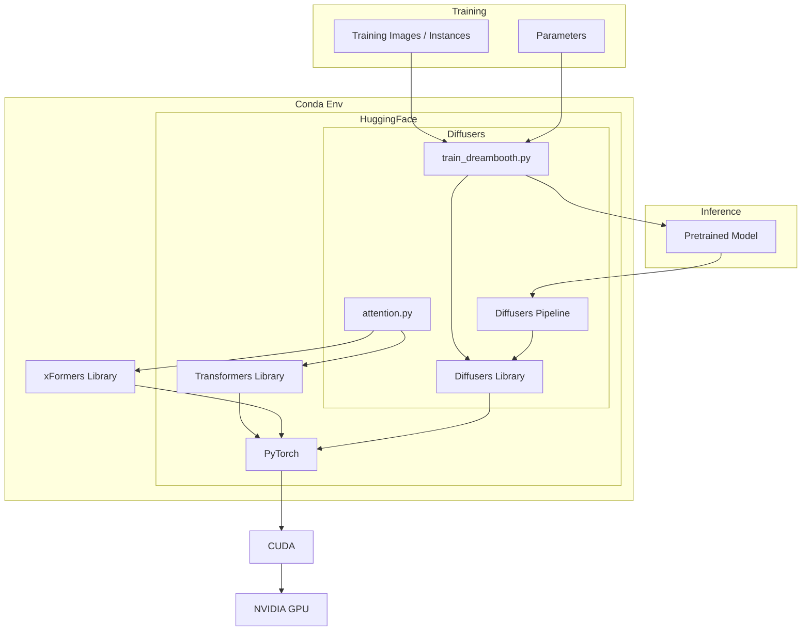

# Stable Diffusion/Dreambooth

An experiment to get myself into SD via Dreambooth

## Map

```mermaid
graph TD;
    gpu[NVIDIA GPU]
    cuda[CUDA]

    subgraph Inference
        model[Pretrained Model]
    end

    subgraph Conda Env
        pytorch[PyTorch]
        xformers[xFormers Library]

        subgraph HuggingFace
            subgraph Diffusers
                train[train_dreambooth.py]
                diffusers[Diffusers Library]
                diffusers_pipe[Diffusers Pipeline]
                attention[attention.py]

                train --> diffusers
            end

            transformers[Transformers Library]
            transformers --> pytorch
        end

        xformers --> pytorch
        attention --> xformers
        attention --> transformers
    end

    subgraph Training
        instances[Training Images / Instances]
        parameters[Parameters]
        instances --> train
        parameters --> train
    end

    train --> model

    model --> diffusers_pipe
    diffusers_pipe --> diffusers
    diffusers --> pytorch
    pytorch --> cuda
    cuda --> gpu
```
