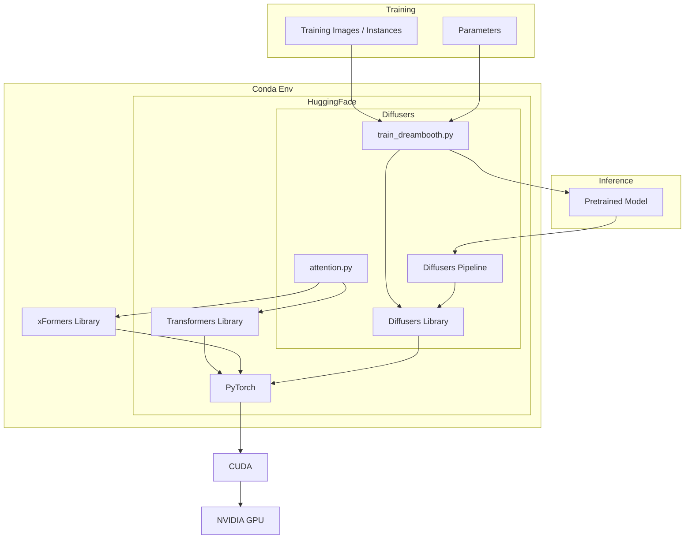

# Stable Diffusion/Dreambooth

An experiment to get myself into SD via Dreambooth

## Get Started

Fair warns: the CDK script starts up a `g4dn` instance; they cost over $0.5 p/h so stop the instance when not in use!

1. Startup infrastructure (`npm install && npx cdk deploy StableDiffusion`). You will need to modify for your own VPC.
2. Copy `scripts/provision.sh` and run on your instance.

## Map

